# Bank-Customers-Deposit-Prediction
### INTRODUCTION

The Bank's capital source is highly dependent on customers' deposits. The deposits have a very important meaning to the Bank because it is the basis for the bank to bring profits through investments, loans, reserves e.t.c. Therefore, it is important for commercial banks to ensure maximum customer satisfaction with the services that the bank provides.\
In Nigeria for example the apex bank called CENTRAL BANK OF NIGERIA (CBN) recently instructed that the minimum paid-up share capital to be maintained for National level banking license is N25 Billion Naira, or any such amount that may be prescribed by the CBN, while for Regional Banking License is N10 Billion Naira and International Commercial Banking License is N50 Billion.This is to ensure the required level of capital adequacy, liquidity, and cash reserve by banks the same step was taking by the apex bank in Ghana and this has led to improved marketing campaign by banks in order to increase customers deposit.

Source of the data https://archive.ics.uci.edu/ml/datasets/bank+marketing

# DATASET DESCRIPTION
# bank client data:
1 - age (numeric)\
2 - job : type of job (categorical: 'admin.','bluecollar','entrepreneur','housemaid','management','retired','self-employed','services','student','technician','unemployed','unknown')\
3 - marital : marital status (categorical: 'divorced','married','single','unknown'; note: 'divorced' means divorced or widowed)\
4 - education (categorical:'basic.4y','basic.6y','basic.9y','high.school','illiterate','professional.course','university.degree','unknown')\
5 - default: has credit in default? (categorical: 'no','yes','unknown')\
6 - housing: has housing loan? (categorical: 'no','yes','unknown')\
7 - loan: has personal loan? (categorical: 'no','yes','unknown')
# related with the last contact of the current campaign:
8 - contact: contact communication type (categorical: 'cellular','telephone')\
9 - month: last contact month of year (categorical: 'jan', 'feb', 'mar', ..., 'nov', 'dec')\
10 - day_of_week: last contact day of the week (categorical: 'mon','tue','wed','thu','fri')\
11 - duration: last contact duration, in seconds (numeric). Important note: this attribute highly affects the output target (e.g., if duration=0 then y='no'). Yet, the duration is not known before a call is performed. Also, after the end of the call y is obviously known. Thus, this input should only be included for benchmark purposes and should be discarded if the intention is to have a realistic predictive model.
# other attributes:
12 - campaign: number of contacts performed during this campaign and for this client (numeric, includes last contact)\
13 - pdays: number of days that passed by after the client was last contacted from a previous campaign (numeric; 999 means client was not previously contacted)\
14 - previous: number of contacts performed before this campaign and for this client (numeric)\
15 - poutcome: outcome of the previous marketing campaign (categorical: 'failure','nonexistent','success')
# Output variable (desired target):
16 - y - has the client subscribed a term deposit? (binary: 'yes','no')

# This project intends to achieve the following:
1 Information about a marketing campaign of a financial institution in order to find ways to look for future strategies in order to improve future marketing campaigns for the bank.\
2 To generate Machine Learning and Deep Learning models that have a high degree of accuracy when predicting if a customer will deposit or not, based on certain predictor variables.

## MODELS EXPLORED
1 Logistic Regression\
2 Random Forest\
3 Extreme Gradient Boost\
4 Decision Tree\
5 GradientBoostingClassifier\
6 LightGradientBoosting\
7 CatBoostClassifier\
8 AdaBoostClassifier\
9 Multi-LayerPerception

### EXPLORATORY DATA ANALYSIS OF DATA SET
## Occupation 
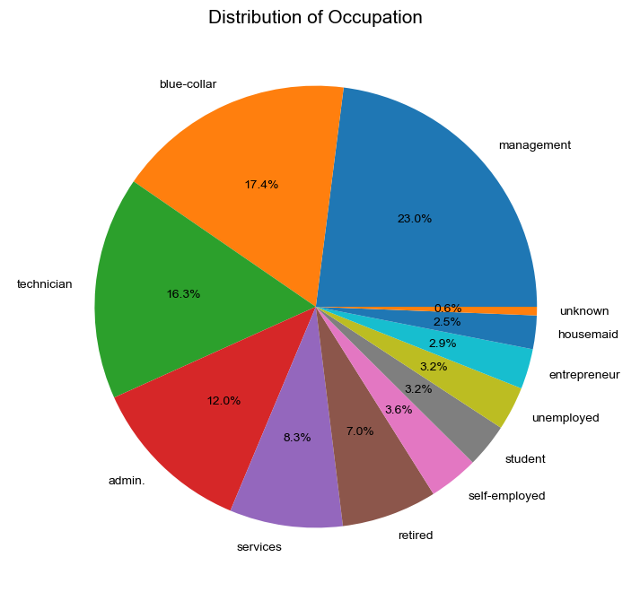

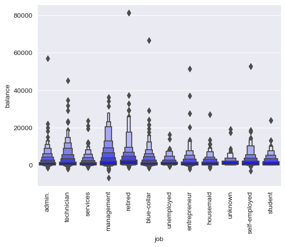

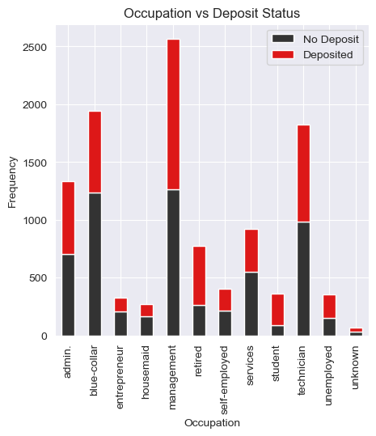

As we can see people with Management jobs are more likly to make deposit.\
We can also notice that most active balance and most deposit are mostly from managemnet and technician related jobs hence the need for the marketing department of the bank to increase marketing campaigns for people doing this jobs, one can also notice high balance of ritirees.

## Marital Status 
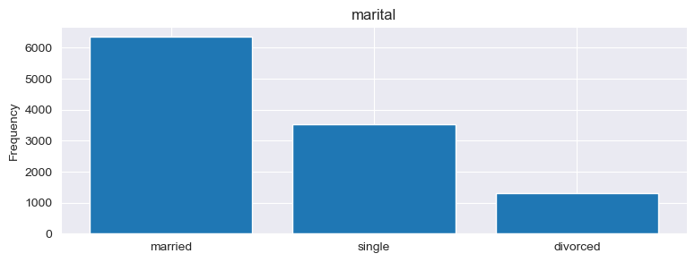

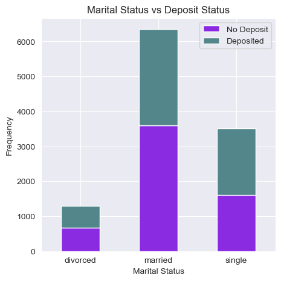

It can be observed that married people where more likely to make a deposit but same can not be said of the divorced, It can also be observed that single people will most likely make a deposit.

## Level Of Education 
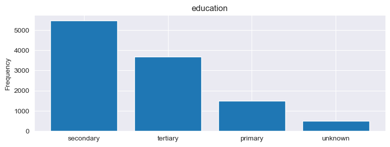

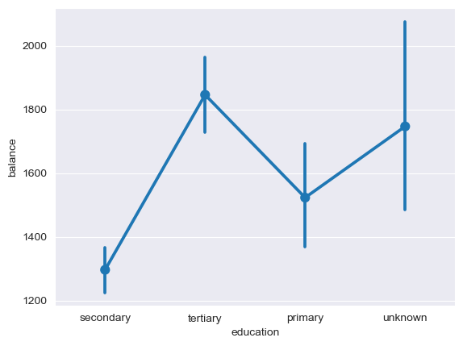

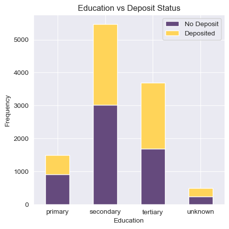

Most customers especially in developing countries in Africa have secondary education and it can be seen that the level of education does not necessarily affect the balance a customer have, but can help determine if a customer will be willing to make a deposit or not, during marketing campaign it will be easier to convince a customer with at least secondary level of education than it will be convincing people with lower educational qualification; Hence the need for the marketing department to start thinking outside the box and implementing creative marketing ideas for banks that will help develop creative campaigns resulting in more consumer engagement.

## Month 
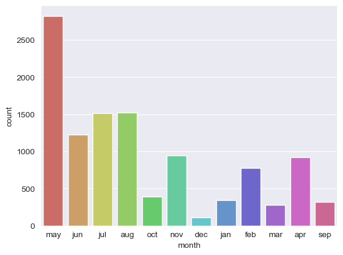

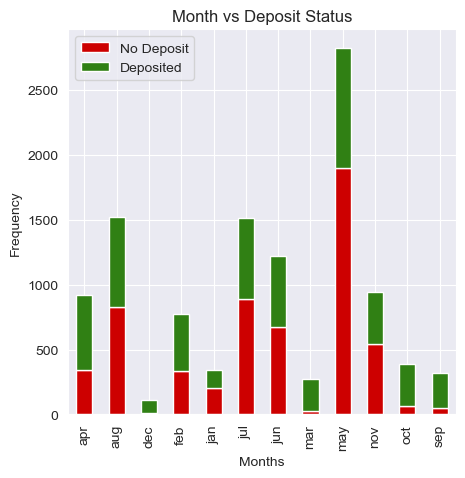

We see that the month of May had highest level of marketing/contact activity with customers. However, this was the month that potential depositors tend to reject deposit offer. For the next marketing campaign, it will be wise for the bank to focus the marketing campaign during the months of March, September, October and December because it had very little rejection of deposit offers. (December should be under consideration because it was the month with the lowest marketing activity yet with promising deposit status, there might be a reason why december is the lowest.)

## Duration of Contact 
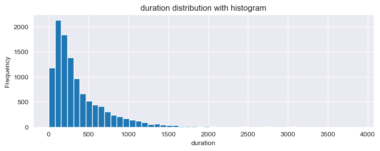

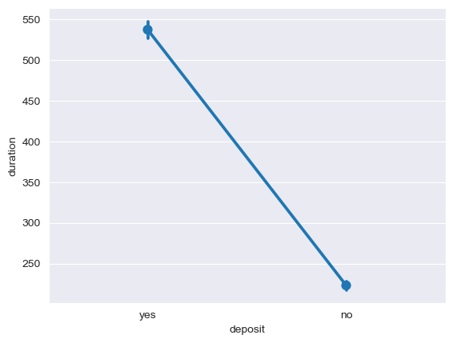

It can be observed that the duration of time spent with a customer determines if the customer will make a deposit or not. Customers with lower duration of contact tend to reject deposit offer.

## Other Observations 
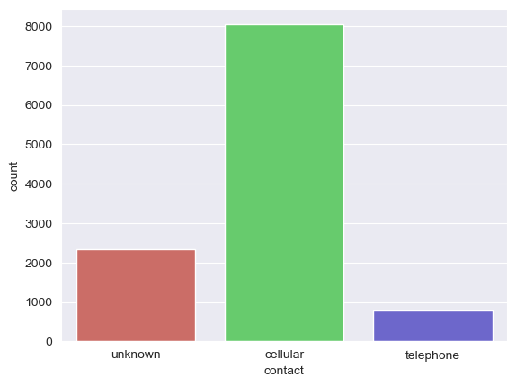

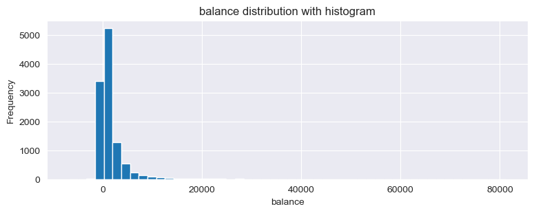

## DATA PROCESSING
To clean up the data and prepare it for model building.\
I obtained the summary of missing values in each column of the data set using the python code. **df.isnull().sum()**. but there were no missing value meaning the data was cleaned already.\

I also transformed all categorical variable with **string values** into a form that is allowed by models for our machine algorithm to make better prediction.\
This process is called **One-Hot Encoding** using the pandas library **df.get_dummies()**.\
and I also used **Label Encoder** and **One-Hot Encoder** from **sklearn.preprocessing**.\

**Deposit_Status** clearly is the target variable while every other features is taken as the independent variable.\
The train_test feature of sci-kit Learn was used to split the data set into 80% for training each of the model while 20% was used to test the model.

After building each model using the data set, the model accuracy for each was computed and arranged to provide information on models that performed well and a best fit for the bank deposit prediction plan.

### MODEL ACCURACY TABLE

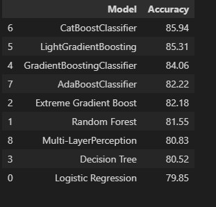
All the Model related to Boosting Classifier performed well with an average of 80% as model accuracy but I took special interest in **CatBoosting Model** that had 85.94% accuracy.\

**CatBoosting Model** is a machine learning algorithm that uses gradient boosting on decision trees.\

with an adjustment of the random_state, depth, l2_leaf_reg and learning_rate of catboost I discovered an increase in the level of accuracy from 85.94% to 86.07%.

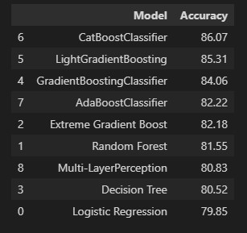

## CONCLUSION
In general, it can be obsereved that all models explored can achieve up to **80%** accuracy to help predict whether or not a potential client will suscribe to a deposit or not.The highest accuracy is **86%** from the **CatBoost Model**.

## RECOMMENDATION
1 Potential clients opted to suscribe term deposits during the seasons of fall and winter. The next marketing campaign should focus its activity throghout these seasons.\
2 The next marketing campaign of the bank should target potential clients in their 20s or younger and 60s or older. It will be great if for the next campaign the bank addressed these two categories and therefore, increase the likelihood of more term deposits suscriptions.\
3  Potential clients that were students or retired were the most likely to suscribe to a deposit. Retired individuals, tend to have more term deposits in order to gain some cash through interest payments. Hence the need to reachout to more retired individuals during marketing campaign.\
4 Since duration of the call with customers is the feature that most positively correlates with whether a potential client will subscribe to a deposit or not, implementing a strategy that will increase the level of engagement of the potential client leading to an increase probability of suscribing to a deposit.\
5 More attention be given to groups that recorded above average in duration of time spent during contact, there is a highly likelihood that this target group would subscribe to deposit.
